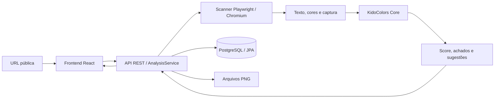

# KidoColors

Aplicação **Full Stack para análise experimental de acessibilidade visual**, com foco no contraste de texto e na diferenciação de cores em páginas web. Recebe uma URL pública, coleta texto e estilos com Chromium, calcula contraste, gera simulações de visão de cores e apresenta um relatório persistido com achados, sugestões e limites da coleta.

O projeto utiliza **React, TypeScript, Java 21, Spring Boot, Playwright e PostgreSQL**. Inclui histórico, comparação de relatórios e processamento sequencial de CSV pela API. Um estudo controlado submeteu **100 páginas públicas, em cinco categorias**, ao Scanner V2: **61 análises concluídas e 39 falhas**, com **10.623 blocos de texto avaliados e 1.158 achados**.

KidoColors é uma ferramenta exploratória de avaliação parcial. Não certifica conformidade WCAG, não substitui auditoria humana e não avalia toda a acessibilidade de um website.

[Funcionamento](#como-funciona) · [Resultados oficiais](#run-2--resultado-oficial) · [Limitações](#limitações) · [Executar](#como-executar) · [Evidências](#artefatos-e-integridade)

## Aplicação

- Análise por URL com estados de execução, falha e relatório.
- Score próprio, cobertura, duração, contraste e sugestões de cor de texto.
- Captura original e simulações de protanopia, deuteranopia e tritanopia.
- Histórico paginado com filtro por URL e comparação de dois relatórios anteriores.
- Importação de CSV, resultados por categoria e exportação CSV/JSON pela API de estudos.

A comparação da interface verifica URL, versão do motor, scores válidos e datas. Ela não garante igualdade do protocolo de coleta; confira os metadados antes de interpretar diferenças, especialmente entre V1 e V2.


Captura real de uma verificação técnica de `example.com`, anterior ao estudo. Ilustra a interface; não representa os resultados do Run 2. O histórico conectado ao banco pode ser visto [nesta captura](docs/screenshots/historico-supabase.png).

## Como funciona

1. O usuário informa uma URL; a API valida formato, protocolo e destino de rede.
2. O scanner abre Chromium, navega e verifica prontidão dentro dos limites definidos.
3. Coleta nós de texto, estilos, posições e cores resolvíveis na região de cobertura; preserva uma captura.
4. Coletas abaixo dos critérios mínimos recebem `FAILED / QUALITY`, sem score.
5. O Core avalia contraste AA dos blocos elegíveis, aplica simulações e heurísticas de diferenciação e produz sugestões de contraste.
6. O backend gera imagens simuladas e persiste relatório, achados e metadados no PostgreSQL; PNGs ficam no sistema de arquivos.
7. A interface recupera os resultados pela API e apresenta relatório e histórico.

Os POSTs são síncronos. Lotes processam uma linha por vez pelo mesmo `AnalysisService`, scanner e Core usados na análise individual. Uma falha de página fica registrada e permite continuar o lote; falhas de persistência podem interrompê-lo. Não há crawler, fila de tarefas ou dashboard de estudos no frontend.

## Arquitetura e tecnologias



| Componente | Responsabilidade e tecnologias |
|---|---|
| `frontend` | React, React Router, TypeScript, Vite, CSS e Fetch; formulário, relatório, capturas e histórico |
| `backend` | Java 21, Spring Boot, API REST, validação, coordenação do scanner/Core e exportação com Apache Commons CSV |
| Scanner | Playwright Java e Chromium; navegação, proteção de rede, coleta visual, screenshot e diagnósticos |
| `kidocolors-core` | Java sem Spring ou banco; cores, luminância, contraste, simulações, heurísticas, sugestões e score |
| Persistência | Spring Data JPA/Hibernate e PostgreSQL; entidades `analysis`, `accessibility_issue` e `study_run` |
| Qualidade | JUnit 5, Mockito, Vitest, React Testing Library e ESLint; build Maven e TypeScript/Vite |

Supabase fornece **somente PostgreSQL via JDBC/JPA**. Não há SDK Supabase, Auth, Storage ou conexão direta do React ao banco. Coletas, relatórios e diagnósticos são armazenados com as análises; imagens ficam em arquivos referenciados pelo backend. H2 é usado apenas nos testes. A configuração de desenvolvimento utiliza `ddl-auto=update`, sem migrations versionadas.

[GitHub Actions](.github/workflows/ci.yml) está configurado para Java, frontend e construção/prontidão de containers. Os testes locais não substituem a verificação remota: consulte a aba Actions para o resultado do commit publicado. Docker é uma alternativa opcional, descrita adiante.

## KidoColors Core

O Core representa cores RGB de 8 bits e converte HEX `#RRGGBB`. O scanner resolve composição de transparência simples antes de enviar cores opacas ao motor.

**Contraste:** luminância relativa sRGB e razão `(L maior + 0,05) / (L menor + 0,05)`. Os achados utilizam os limiares de texto do critério WCAG 2.2 1.4.3, nível AA: **4,5:1** para texto normal e **3:1** para texto grande. Texto grande corresponde a pelo menos 24 CSS px ou 18,666… CSS px em negrito, com peso ≥ 700. A comparação não arredonda a razão. O Core também oferece avaliação AAA, mas os achados do relatório usam AA.

**Simulações e heurísticas:** matrizes atribuídas a Machado, Oliveira e Fernandes (2009), aplicadas em RGB linear, produzem as três simulações. A opção chamada TRITANOPIA usa uma aproximação ilustrativa baseada na matriz de tritanomalia; não reproduz de forma validada a percepção individual. Avisos de diferenciação comparam pares próximos de cores sob simulação, por distância RGB e limiares próprios. Não são falhas normativas WCAG nem diagnósticos clínicos.

**Sugestões:** mantêm o fundo e procuram uma cor de texto que atinja AA, misturando a cor original em direção a preto/branco e recalculando o contraste. São alternativas para revisão contextual, sem garantia de solução perceptual ótima.

### Score próprio

```text
KidoColors Accessibility Score =
    round(100 × (blocos avaliáveis − falhas de contraste AA) / blocos avaliáveis)
```

É uma métrica agregada **do projeto**, não um score WCAG oficial. Os avisos heurísticos não entram na fórmula. Score 100 indica que os blocos avaliados passaram no contraste AA; score 0 indica que todos os blocos avaliados falharam. Ausência de avaliação válida ou falha operacional deixa o score ausente, nunca convertido em zero.

Um nó de texto coletado é tratado como bloco; isso não corresponde necessariamente a um elemento DOM único. O total de achados soma falhas por bloco e avisos de combinações de cores, podendo não equivaler ao número de elementos únicos. As [fórmulas, matrizes, atribuições e heurísticas](docs/methodology.md) estão documentadas separadamente; esse documento registra a descrição histórica do motor V1, cuja matemática foi mantida no V2. Para coleta e elegibilidade atuais, valem os critérios abaixo.

## Scanner V2

O Scanner V2 revisou cobertura, prontidão e observabilidade a partir da auditoria do piloto. **Não alterou fórmula, thresholds ou simulações do Core**, nem foi ajustado individualmente por URL durante o Run 2.

| Parâmetro uniforme do Run 2 | Valor |
|---|---|
| Navegação | `DOMContentLoaded` |
| Orçamento de navegação, incluindo redirects HTTP | 30.000 ms |
| Prontidão | Até 5.000 ms |
| Estabilidade | 500 ms, amostragem a cada 100 ms |
| Sinal de prontidão | Texto visível do body, fontes carregadas e estabilidade dos primeiros 2.000 caracteres/altura |
| Viewport | 1280 × 720; escala 1; locale `pt-BR`; timezone UTC |
| Região de coleta/captura | Parte superior, 1280 px de largura e até 12.000 px de altura |
| Máximo de blocos de texto | 2.000 |
| Redirects | Até cinco por cadeia, com destinos validados |

O limite de navegação não é um deadline global: iniciar o navegador, coletar, capturar, transformar imagens, fechar recursos e persistir também consomem tempo. Não há auto-scroll, paginação ou coleta de infinite scroll.

Cores CSS modernas aceitas pelo Chromium são normalizadas para sRGB de 8 bits. Um fundo opaco descendente pode resolver a incerteza causada por imagem/gradiente ancestral; uma imagem no próprio elemento, transparência incerta ou efeitos não resolvidos continuam impedindo avaliação, com `unsupportedReason`. O scanner não inventa contraste para fundos que não consegue determinar.

`QUALITY` rejeita PNG uniforme, coleta vazia, ausência de textos avaliáveis, prontidão insuficiente ou certos placeholders de carregamento. Capturas parciais são preservadas quando disponíveis. Diagnósticos registram protocolo, URLs sanitizadas, HTTP quando observado, fase, código, mensagem, causa técnica, duração, redirects e cobertura. Falhas posteriores à captura, inclusive cleanup, recebem fase própria.

O [protocolo V2](docs/scanner-v2.md) e sua [validação anterior à coleta](docs/scanner-v2-validation.json) são documentos históricos preservados: os estados “aguardando revisão”/“Run 2 não executado” descrevem aquele momento. A configuração efetivamente usada está no [registro pré-execução do Run 2](results/experimental-study-2026-10-07-run-2-scanner-v2/effective-config-before-run.json).

### Segurança de navegação

São aceitos HTTP/HTTPS, sem credenciais embutidas na URL. A política valida nomes e endereços resolvidos, bloqueia localhost e faixas privadas/reservadas e valida cada destino de redirect antes de segui-lo. GET/HEAD são permitidos; métodos de escrita, WebSockets, service workers e WebRTC são bloqueados. O navegador não utiliza a sessão autenticada do usuário.

Isso reduz requisições indesejadas, mas **não é proteção absoluta contra SSRF**: a verificação DNS não fixa o IP da conexão, deixando uma limitação conhecida de DNS rebinding. A aplicação se destina ao uso local; um serviço público precisaria de isolamento e controles adicionais.

## Estudo experimental

A amostra foi composta por **100 páginas públicas, predominantemente de organizações brasileiras e em português**, com 20 páginas em cada categoria: E-commerce, Educação, Notícias e conteúdo, Serviços e Empresas e instituições. A seleção ocorreu antes da coleta, buscando diversidade de organizações e serviços, sem considerar resultados ou acessibilidade aparente. Utilizou-se preferencialmente a homepage pública oficial, sem exigir login para o conteúdo principal e sem repetir uma organização.

É uma **amostragem intencional por quotas**, não uma amostra estatisticamente representativa dos websites brasileiros nem uma lista dos “100 maiores sites”. O [dataset documentado](datasets/websites.csv) e a [versão de revisão no Excel](datasets/kidocolors-dataset.xlsx) foram congelados antes do experimento.

Run 1 e Run 2 ocorreram em **07/10/2026**, com os mesmos IDs, sites, URLs, categorias e ordem. No Run 2 houve uma tentativa por linha, parâmetros uniformes, nenhuma substituição de URL, ajuste durante o lote ou repetição seletiva. O ambiente oficial utilizou **Java local no Windows, Chromium 153.0.8010.12 e Supabase PostgreSQL**, sem Docker.

### Run 1 — piloto

O piloto tentou 100 páginas: **53 concluídas, 47 falhas, 50 com score, 8.262 elementos avaliados e 1.184 achados**. Foram registrados 18 TIMEOUT. Três execuções concluíram sem score.

A [auditoria das 47 falhas](docs/study-failure-audit.md) identificou limitações de diagnóstico, redirects, altura de página e coleta, motivando uma revisão controlada do protocolo. Isso não demonstra que os resultados do piloto estavam errados nem permite atribuir todas as falhas a bugs. O Run 1 permanece integral e separado.

### Evolução V1 → V2

| Aspecto | Run 1 / V1 | Run 2 / V2 |
|---|---|---|
| Concluídas / falhas | 53 / 47 | 61 / 39 |
| Sucesso operacional | 53% | 61% |
| Páginas com score | 50 | 61 |
| TIMEOUT / QUALITY | 18 / não existente | 1 / 15 |
| Prontidão | LOAD + 500 ms; timeout 15 s | DOMCONTENTLOADED; navegação 30 s; prontidão até 5 s |
| Redirects HTTP | Bloqueados | Destinos validados, até cinco saltos |
| Páginas acima de 12.000 px | Abortadas por altura | Região superior limitada, com truncamento explícito |
| Coleta de cores/fundos | Exclusões mais amplas | Normalização CSS e resolução de fundo opaco descendente |
| Diagnóstico | Código/mensagem genéricos | HTTP quando disponível, fase e causa técnica |

Os protocolos de coleta e os critérios de conclusão diferem. Comparar sucesso operacional descreve o funcionamento das execuções; **diferenças de score não demonstram melhora ou piora dos websites**. Os runs não foram combinados estatisticamente. Conteúdo e condições externas também podem variar. [Comparação técnica completa](results/experimental-study-2026-10-07-run-2-scanner-v2/run1-vs-run2-comparison.md).

## Run 2 — resultado oficial

Resultado experimental oficial desta versão: **100 tentativas, 61 análises concluídas com score, nenhuma concluída sem score e 39 falhas**. Sucesso operacional: **61,00% das tentativas**.

| Medida | Resultado |
|---|---:|
| Blocos coletados observados, incluindo capturas de falhas | 14.044 |
| Coletados em análises concluídas | 11.498 |
| Coletados em capturas de falhas, sem avaliação pelo Core | 2.546 |
| Blocos avaliados / ignorados em relatórios concluídos | 10.623 / 875 |
| Achados totais | 1.158 |
| Concluídas com pelo menos um achado | 56 de 61 — 91,80% |
| Score médio / mediana | 87,44 / 90,00 |
| Score mínimo / máximo | 42 / 100 |
| Média de achados por análise concluída | 18,98 |
| Tempo total do lote | 2.335,670 s — aproximadamente 38 min 56 s |

Os 14.044 blocos são a coleta **observada nas capturas disponíveis**, não uma estimativa das páginas sem captura. Score e achados usam somente análises concluídas; textos de capturas de falhas não são apresentados como avaliados pelo motor.

| Tipo de achado | Quantidade |
|---|---:|
| Falhas de contraste AA | 1.139 |
| Avisos heurísticos — protanopia | 6 |
| Avisos heurísticos — deuteranopia | 4 |
| Avisos heurísticos — tritanopia | 9 |

| Faixa de score | Análises com score |
|---|---:|
| 0–24 | 0 |
| 25–49 | 3 |
| 50–74 | 6 |
| 75–100 | 52 |

Score médio relativamente alto e achados em 56/61 análises não são contraditórios: um conjunto pode conter muitos blocos que passam em AA e problemas pontuais. Os avisos heurísticos são apresentados separadamente e não reduzem o score. **91,80% é a proporção das análises concluídas com achados na cobertura avaliada**, não a proporção de “sites inacessíveis”. Zero achados tampouco certifica acessibilidade global.

### Resultados por categoria

| Categoria | Tentadas | Concluídas | Falhas | Sucesso operacional | Score médio | Mediana |
|---|---:|---:|---:|---:|---:|---:|
| E-commerce | 20 | 9 | 11 | 45,00% | 91,11 | 90,00 |
| Educação | 20 | 15 | 5 | 75,00% | 85,87 | 87,00 |
| Empresas e instituições | 20 | 15 | 5 | 75,00% | 82,13 | 86,00 |
| Notícias e conteúdo | 20 | 12 | 8 | 60,00% | 92,67 | 96,50 |
| Serviços | 20 | 10 | 10 | 50,00% | 88,20 | 91,00 |

Médias e medianas consideram apenas as concluídas de cada categoria. Diferenças de cobertura e falhas operacionais impedem tratar essa tabela como ranking simples de acessibilidade.

### Falhas operacionais e QUALITY

| Código | Quantidade | Observação no Run 2 |
|---|---:|---|
| INACCESSIBLE | 22 | Navegação: 20 respostas HTTP 403, uma 500 e uma 405 |
| QUALITY | 15 | Resposta HTTP 200, mas coleta abaixo dos critérios mínimos |
| BROWSER | 1 | Natura, fase CLEANUP após captura, HTTP 200; `TargetClosedError` |
| TIMEOUT | 1 | KC-083, fase NAVIGATION, sem resposta HTTP preservada |

INACCESSIBLE significa que a página não pôde ser analisada no protocolo diante da resposta observada. HTTP 403 pode refletir bloqueio de acesso automatizado; não prova indisponibilidade global nem problema de acessibilidade. TIMEOUT é um limite operacional. BROWSER identifica falha técnica do navegador/processo. **Nenhuma dessas falhas recebe score zero.** Não houve BLOCKED ou LIMIT_EXCEEDED nesta execução.

| Motivo QUALITY | Páginas |
|---|---:|
| CONTENT_NOT_STABLE | 12 |
| NO_VISIBLE_TEXT_AT_READINESS | 3 |
| ZERO_COLLECTED_ELEMENTS | 1 |
| UNIFORM_SCREENSHOT | 1 |

Uma página pode ter vários motivos, portanto essas contagens não devem ser somadas como páginas distintas. QUALITY impede produzir score quando falta evidência de coleta suficiente; não significa ausência de problemas de acessibilidade.

### Truncamento e recursos

**58 das 61 análises concluídas tiveram coleta truncada.** Esse sinal inclui perda por altura, posição fora da região ou limite de elementos; não significa que todas excederam 12.000 px. Entre as 77 capturas com metadados disponíveis, nove registraram truncamento por altura. Não há auto-scroll ou paginação automática.

O score descreve somente os blocos avaliáveis dentro da cobertura. Conteúdo fora dela não entra no cálculo, e o score não representa necessariamente a página inteira. Duas análises concluídas também atingiram o limite de comparação de pares das heurísticas de diferenciação.

As capturas disponíveis registraram 1.616 requisições bloqueadas ou com falha; 1.035 ocorreram em análises concluídas. Esse campo não permite inferir um total de recursos para páginas sem captura nem considerar cada ocorrência uma tentativa maliciosa.

## Principais observações do estudo

- Falhas de contraste predominam nos achados; os avisos heurísticos de diferenciação são uma parte distinta do total.
- A maioria das análises concluídas apresentou pelo menos um achado dentro da região e dos critérios avaliados.
- Scores agregados altos podem coexistir com problemas pontuais, sem contradição na fórmula.
- Sucesso operacional variou entre categorias; isso descreve execução e elegibilidade, não acessibilidade global.
- A coleta parcial e as falhas limitam a interpretação; não há base para generalizar conclusões para todos os sites brasileiros.

## Limitações

- **Amostra e validade:** seleção intencional por quotas; 61/100 concluídas; sem representatividade estatística e sem referência humana. Não foram produzidos precision, recall, F1 ou comprovação empírica da eficácia do detector.
- **Cobertura:** região superior limitada, blocos fora da cobertura excluídos, sem rolagem/interação automática; a coleta não atravessa iframes ou Shadow DOM nem captura texto de imagens, canvas ou pseudo-elementos.
- **Contexto visual:** overlays, oclusão, clipping, fundos fotográficos/gradientes incertos, filtros e transparência complexa podem escapar ou causar exclusões. Normalização de cores wide gamut para sRGB pode recortar valores. Exceções contextuais de contraste precisam de revisão humana.
- **Estado externo:** conteúdo dinâmico, consentimento de cookies, lazy loading, fontes, WAF/CAPTCHA, respostas 403/429 e falhas de rede podem impedir ou alterar a coleta. Readiness limitado não prova carregamento integral.
- **Recursos e segurança:** bloqueios de requisições podem mudar a aparência; DNS rebinding permanece possível entre validação e conexão. Não há autenticação/rate limiting de um serviço público nem isolamento completo de rede.
- **Interpretação:** score próprio e heurísticas não equivalem a conformidade WCAG; simulações aproximam percepção e não validam perda de informação. Achados precisam de revisão contextual.
- **Operação:** processamento síncrono; interrupção pode deixar registros RUNNING. Não há recuperação automática ou migrations de produção. Capturas demandam armazenamento local.

Há um [protocolo de validação humana](docs/validation.md) e um avaliador offline de rótulos, mas sua existência e os testes matemáticos não substituem um estudo com referência humana.

## Como executar

### Pré-requisitos

JDK **21** com `javac`, Maven **3.9+**, Node.js **24+** com npm, Git e um PostgreSQL acessível. Os comandos abaixo são para **PowerShell na raiz do repositório**. O Chromium é instalado pelo Playwright; Docker é opcional.

### Banco e variáveis locais

Copie o exemplo somente se ainda não tiver configuração:

```powershell
if (-not (Test-Path .env.local)) { Copy-Item .env.example .env.local }
```

Preencha `.env.local` com valores do seu próprio banco:

```dotenv
DB_URL=jdbc:postgresql://HOST_DO_BANCO:5432/postgres?sslmode=require
DB_USERNAME=USUARIO_DO_BANCO
DB_PASSWORD=SENHA_DO_BANCO
```

No Supabase, obtenha a conexão JDBC/PostgreSQL em **Connect**, usando Session pooler compatível com sua rede. Usuário e senha ficam separados da URL; não são chaves da API Supabase. `sslmode=require` exige criptografia, sem verificar identidade do servidor; `verify-full` exige certificado adequado. [Detalhes de conexão e configuração](docs/local-development.md#criar-e-configurar-postgresql-no-supabase).

`.env.local` é ignorado pelo Git e não pertence ao frontend. Não publique senhas, tokens ou connection strings com credenciais. Spring não carrega esse arquivo automaticamente: o script de inicialização importa somente variáveis conhecidas. Os tempos configuráveis são `SCANNER_TIMEOUT_MS`, `SCANNER_READINESS_TIMEOUT_MS` e `SCANNER_SETTLE_MS`; mantenha os valores do protocolo ao interpretar esta versão. `CAPTURE_STORAGE_PATH` controla o armazenamento de PNGs.

### Preparar Java e Chromium

```powershell
$mavenCache = Join-Path (Get-Location).Path '.maven-cache'
$env:PLAYWRIGHT_BROWSERS_PATH = Join-Path (Get-Location).Path '.playwright'
$env:PLAYWRIGHT_SKIP_BROWSER_DOWNLOAD = '1'
mvn.cmd -B -ntp "-Dmaven.repo.local=$mavenCache" '-DskipTests' install
mvn.cmd -B -ntp -f backend/pom.xml "-Dmaven.repo.local=$mavenCache" exec:java '-Dexec.mainClass=com.microsoft.playwright.CLI' '-Dexec.args=install chromium'
mvn.cmd -B -ntp "-Dmaven.repo.local=$mavenCache" verify
```

Interrompa a sequência se um comando falhar. O primeiro prepara dependências, sem validar testes; o último testa e empacota. Em Linux, instale também as dependências de sistema do Chromium, como faz o job Java do CI com `install --with-deps chromium`.

### Backend e frontend

Terminal 1, na raiz:

```powershell
.\scripts\start-backend.ps1
```

Terminal 2:

```powershell
cd frontend
npm.cmd ci
npm.cmd run dev
```

Abra **http://127.0.0.1:5173**. O Vite encaminha `/api` para `localhost:8080`; `/api/health` verifica o banco com `SELECT 1`. O backend usa `storage/captures` por padrão. `Ctrl+C` encerra os servidores. O script Windows aplica um contorno de sockets NIO somente à JVM iniciada; os [detalhes operacionais](docs/local-development.md#iniciar-no-vs-code) estão no guia local.

`npm run build` gera arquivos estáticos; `npm run preview` não inicia o backend. Para servir a aplicação completa, configure também o proxy `/api`, como no Nginx existente.

### Docker opcional

Os Dockerfiles e o Compose fornecem a alternativa React/Nginx → API → PostgreSQL em containers, com banco próprio, independente do Supabase:

```powershell
if (-not (Test-Path .env.docker)) { Copy-Item .env.docker.example .env.docker }
# Preencha DB_PASSWORD em .env.docker.
docker compose --env-file .env.docker up -d --build --wait
```

Interface: **http://localhost:3000**. [Portas, volumes, logs e encerramento](docs/docker.md). Docker **não foi usado no Run 2** e containers não foram executados nesta revisão final; a configuração está presente e há um job específico no CI.

## Testes e validação atual

Verificação local em **07/10/2026**, repetida na revisão deste README:

| Verificação | Resultado |
|---|---|
| Core — JUnit | 27 testes passaram |
| Backend — JUnit/Mockito, API/JPA e scanner | 77 testes passaram |
| Frontend — Vitest/React Testing Library | 24 testes passaram |
| Maven verify, perfil `scanner-v2` | BUILD SUCCESS; sem falhas, erros ou testes ignorados nas suítes Java |
| ESLint | Passou |
| TypeScript e build Vite | Passaram |

**128 testes no total.** Isso não é uma afirmação de 100% de cobertura de código. H2 e mocks verificam API/persistência isolada; Chromium real e fixtures HTTP locais verificam redirects, destinos privados, páginas longas, cores/backgrounds, carregamento, QUALITY, captura e cleanup. Testes determinísticos do Core verificam contraste, score, simulações, similaridade e sugestões. Nenhuma das 100 URLs foi reexecutada para esta validação.

```powershell
# Na raiz, com Chromium preparado:
mvn.cmd -B -ntp "-Dmaven.repo.local=$mavenCache" -Pscanner-v2 verify

# No diretório frontend:
npm.cmd test
npm.cmd run lint
npm.cmd run build
```

O perfil `scanner-v2` grava builds em `target-v2`, permitindo verificar sem substituir JARs de outros processos. O script padrão de inicialização usa `backend/target`; para esse caminho, prepare o build normal mostrado acima. Não há lint Java separado configurado.

## API REST

| Operação | Endpoint |
|---|---|
| Criar análise síncrona | `POST /api/analyses` — JSON com `url`, categoria opcional |
| Consultar análise / histórico | `GET /api/analyses/{id}`; `GET /api/analyses?page=0&size=20` |
| Filtrar histórico por URL | `GET /api/analyses/by-url?url=...` |
| Coleta / relatório | `GET /api/analyses/{id}/capture`; `GET /api/analyses/{id}/report` |
| Captura original / simulada | `GET /api/analyses/{id}/screenshot`, parâmetro opcional `simulation` |
| Criar lote síncrono | `POST /api/studies` — multipart com `name` e `file` |
| Resultado do lote em JSON | `GET /api/studies/{id}` |
| CSV de resultados / dataset importado | `GET /api/studies/{id}/export.csv`; `GET /api/studies/{id}/dataset.csv` |
| Prontidão API/banco | `GET /api/health` |

Criação pode responder 201 com um registro `FAILED`; consulte `status`, `errorCode` e diagnóstico. Falha operacional não é erro de formato de entrada. O [guia de lotes](docs/studies.md) descreve a importação: `id,site,url,categoria`. O CSV de seleção com oito colunas é documentação da amostra; os runs preservam separadamente o CSV de quatro colunas enviado ao processamento. A exportação padrão da API e o CSV de pesquisa com diagnósticos são artefatos distintos.

## Estrutura do repositório

```text
frontend/                     Interface React e testes
backend/                      API, scanner, persistência e fixtures
kidocolors-core/              Motor Java independente
datasets/                     Seleção documentada e planilha de revisão
docs/                         Metodologia, auditoria e guias
results/
  experimental-study-2026-10-07/                  Run 1 / piloto
  experimental-study-2026-10-07-run-2-scanner-v2/   Run 2 / oficial
scripts/                      Inicialização e utilitários de execução
.github/workflows/            CI
pom.xml                       Build Java multimódulo
docker-compose.yml            Execução alternativa em containers
.env.example                  Referência de configuração local
```

## Artefatos e integridade

| Evidência | Local |
|---|---|
| Amostra e critérios | [CSV](datasets/websites.csv), [XLSX](datasets/kidocolors-dataset.xlsx), [documentação](datasets/README.md) |
| Run 1 preservado | [Diretório do piloto](results/experimental-study-2026-10-07/) |
| Auditoria do piloto | [Relatório](docs/study-failure-audit.md), [classificação CSV](docs/study-failure-audit.csv) |
| Protocolo e validação anteriores ao Run 2 | [Scanner V2](docs/scanner-v2.md), [registro de validação](docs/scanner-v2-validation.json) |
| Run 2 oficial | [Resumo](results/experimental-study-2026-10-07-run-2-scanner-v2/study-summary.md), [CSV por página](results/experimental-study-2026-10-07-run-2-scanner-v2/study-results.csv), [estatísticas JSON](results/experimental-study-2026-10-07-run-2-scanner-v2/study-statistics.json) |
| Falhas e imagens | [Diagnósticos](results/experimental-study-2026-10-07-run-2-scanner-v2/failure-diagnostics.json), [verificação PNG](results/experimental-study-2026-10-07-run-2-scanner-v2/screenshots-verification.json), [dados brutos](results/experimental-study-2026-10-07-run-2-scanner-v2/raw/) |
| Comparação entre protocolos | [Run 1 × Run 2](results/experimental-study-2026-10-07-run-2-scanner-v2/run1-vs-run2-comparison.md) |
| Rastreabilidade | [Manifesto de execução](results/experimental-study-2026-10-07-run-2-scanner-v2/manifest.json), [inventário SHA-256](results/experimental-study-2026-10-07-run-2-scanner-v2/raw-artifacts-manifest.json), [verificação de integridade](results/experimental-study-2026-10-07-run-2-scanner-v2/integrity-verification.json) |
| Identidade dos binários locais | [Binários experimentais e política de Git](docs/experimental-binaries.md) |
| Revisão documental final | [Validação e pendências de publicação](docs/final-documentation-review.md) |

Os CSVs/estatísticas diretamente em `results/` pertencem ao **piloto**; o resultado oficial está na pasta específica do Run 2. Documentos de fases anteriores são registros históricos, não atualizações retroativas dos experimentos.

O dataset, JAR aprovado, fontes e configuração foram congelados antes do Run 2. Seus números foram recalculados e confrontados com a API e os relatórios individuais. Os registros finais confirmam preservação de 454 arquivos protegidos e dos hashes de 1 estudo, 100 análises e 1.184 achados do piloto no PostgreSQL. Nesta revisão documental, foram novamente conferidos os manifestos e 1.158 arquivos protegidos, sem alterar resultados ou código.

Essas medidas favorecem rastreabilidade; não garantem reprodução idêntica de websites externos que mudam ao longo do tempo. Os JARs originais utilizados nas execuções estão preservados localmente, com identidade SHA-256 registrada nos manifestos, e são excluídos do Git pelo tamanho. Código-fonte, configurações, versões, nomes dos artefatos, hashes e resultados permanecem na seleção para versionamento. Maven permite gerar novos JARs a partir das fontes; recompilar não substitui o binário histórico nem garante hash idêntico. A [política de binários experimentais](docs/experimental-binaries.md) explica quais arquivos estarão ausentes em um clone e como identificar os originais. Não foi usado Git LFS.

**Ressalva Natura — KC-006:** terminou como `BROWSER / CLEANUP`, sem score ou achados. A captura preservada tem 1280 × 4130 px, enquanto a cobertura declarada é 1280 × 4207 px. A causa não foi determinada; conteúdo dinâmico é apenas hipótese. Não houve correção retroativa. O caso consta nas verificações geométricas; as capturas das 61 análises concluídas correspondem às dimensões declaradas.

## Possíveis evoluções

Ampliar cobertura por rolagem/interação controlada; estudar suporte a iframe/Shadow DOM; validar uma amostra com referência humana; avaliar heurísticas separadamente; diversificar unidades/páginas e reforçar diagnóstico e isolamento de rede. São possibilidades futuras, não funcionalidades desta versão nem alterações do estudo encerrado.

## Autoria

Projeto de portfólio desenvolvido por [KamillyFer-8](https://github.com/KamillyFer-8). Repositório: [KamillyFer-8/KidoColors](https://github.com/KamillyFer-8/KidoColors). Referências e atribuições do modelo de cores estão na documentação metodológica.
