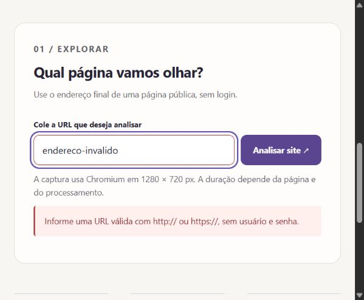
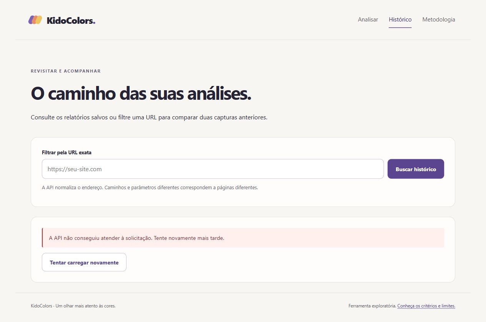
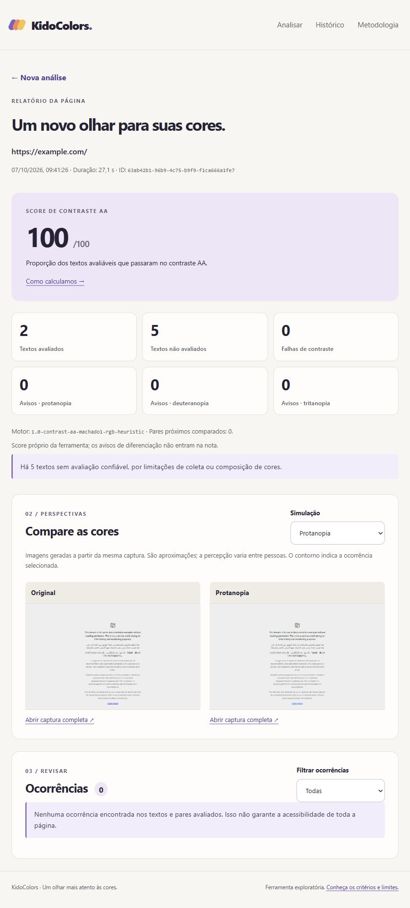
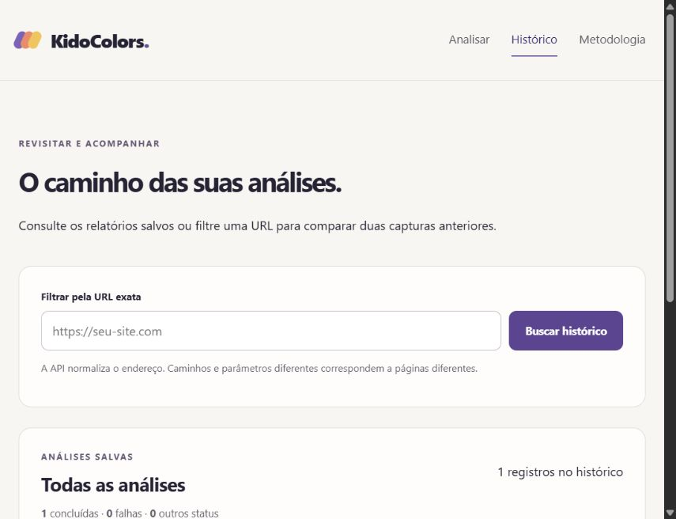

# KidoColors

Projeto Full Stack de portfólio júnior para analisar acessibilidade visual de uma página por URL. O objetivo é oferecer relatório de contraste, simulações de deficiência de visão de cores, sugestões e histórico; depois da validação, permitir um estudo reproduzível com aproximadamente 100 páginas reais.

## Estado atual

Fases 1–7 implementadas: Core, API com JPA, scanner Playwright, motor de contraste/simulações/sugestões/score próprio, interface React, histórico e processamento em lote. POST executa o processamento e salva COMPLETED ou FAILED com duração medida. Textos não avaliáveis ficam fora do score; sem cobertura, score nulo. A interface apresenta formulário, relatório, comparação de capturas, ocorrências, metodologia e histórico paginado com filtro por URL e comparação de dois relatórios. Lotes importam CSV pelo mesmo AnalysisService, registram duração própria, falhas e estatísticas e exportam CSV/JSON. Nenhuma coleta do estudo real foi executada. Consulte as [instruções do Front-End](frontend/README.md), [instruções do Backend](backend/README.md), [execução de lotes](docs/studies.md) e [metodologia](docs/methodology.md).

## Ambiente e VS Code

A estrutura da Fase 8 está preparada: [protocolo de validação manual](docs/validation.md), template vazio em datasets/validation e comando offline para calcular métricas a partir de rótulos humanos. A validação empírica ainda não ocorreu; não há dataset rotulado real nem métricas de eficácia. Isso continua sendo requisito antes do estudo.

Abra esta pasta inteira no VS Code. Use Terminal → Novo Terminal, na raiz.

Ferramentas para desenvolvimento: JDK 21 (incluindo javac), Maven 3.9+, Node.js 24+ com npm e Git. React/Vite e Spring Boot/Core executam localmente; PostgreSQL fica hospedado, preferencialmente no Supabase. Docker é opcional e não é requisito para desenvolver ou executar desta forma.

Supabase é usado somente como PostgreSQL acessado por JDBC/JPA. Nenhum SDK, Auth, Storage ou API automática é necessário. O notebook não utiliza Docker; a ausência dele não bloqueia as fases seguintes.

Extensão útil agora: Extension Pack for Java, para navegação, execução e depuração Java. Depois: Spring Boot Extension Pack para iniciar/depurar a API, ESLint para avisos do Front-End e Prettier para formatação. A extensão Docker é opcional para visualizar containers. Os comandos não dependem dessas extensões.

```powershell
java -version
javac -version
mvn -version
node --version
npm.cmd --version
git --version

# Executar testes do Core/Backend e gerar os JARs
$env:PLAYWRIGHT_BROWSERS_PATH = Join-Path (Get-Location).Path '.playwright'
mvn.cmd '-Dmaven.repo.local=.maven-cache' verify
```

No PowerShell, npm.cmd evita depender da política de execução de scripts npm.ps1. O parâmetro Maven entre aspas mantém o cache de dependências dentro do projeto e evita o caminho padrão sem permissão encontrado neste ambiente. O JAR será gerado em kidocolors-core/target/. Não há lint Java separado nesta fase; compilação e testes são as verificações atuais.

Antes de executar verify pela primeira vez, instale o Chromium conforme backend/README.md. verify executa Core e Backend e gera também o JAR executável em backend/target/. Verificação da Fase 4 em 06/10/2026: 78 testes passaram (27 Core, 51 Backend), sem falhas ou testes ignorados; BUILD SUCCESS. A integração PostgreSQL real continua pendente; a persistência foi testada com H2.

Verificação da Fase 5 em 06/10/2026: 12 testes do Front-End passaram, lint e build sem erros. A Home e a validação de URL inválida foram conferidas no navegador. A API não estava em execução na porta 8080; a verificação integrada com banco real permanece pendente. Para iniciar a interface em outro terminal:

```powershell
cd frontend
npm.cmd ci
npm.cmd run dev
```

Verificação da Fase 6 em 06/10/2026: 24 testes do Front-End passaram, lint e build sem erros. Histórico paginado, filtro por URL, métricas da página e comparação de dois relatórios implementados. A variação de score exige a mesma versão do motor, mesma URL, scores válidos e datas distintas. O navegador confirmou o estado de erro com a API indisponível; o histórico com PostgreSQL real ainda precisa de verificação integrada.

Verificação da Fase 7 em 06/10/2026: Maven verify gerou o JAR executável com BUILD SUCCESS; 92 testes Java passaram (27 Core, 65 Backend), incluindo 14 de importação, métricas, persistência e exportação de lotes. Testes de integração usam H2 e scanner simulado, além dos testes existentes do scanner com Chromium e páginas locais. Nenhum CSV do estudo real foi processado; PostgreSQL real permanece pendente.

## Estrutura atual

```text
KidoColors/
├── frontend/              React + TypeScript
├── backend/               API Spring e scanner
├── kidocolors-core/       Java puro, sem Spring ou banco
├── datasets/              Dataset real, após aprovação
├── results/               Exportações reais
├── docs/                  Arquitetura e metodologia
├── .github/workflows/     CI (Fase 10)
├── pom.xml                Build Maven dos módulos Java
├── docker-compose.yml     Execução completa (Fase 9)
├── .env.example
├── .env.docker.example    Variáveis do Compose opcional
├── scripts/              Inicialização local e verificação HTTP
└── README.md
```

Somente os módulos implementados entram no Maven. As configurações Docker e CI estão preparadas, com limites de verificação documentados.

## Duas formas de execução

**Desenvolvimento local sem Docker:** configure `.env.local` com `DB_URL`, `DB_USERNAME` e `DB_PASSWORD` do PostgreSQL hospedado. [Guia do Supabase, preparação do Chromium e testes](docs/local-development.md). Depois da preparação, use dois terminais do VS Code:

```powershell
# Terminal 1, na raiz: Spring Boot + Core → PostgreSQL hospedado
.\scripts\start-backend.ps1
```

```powershell
# Terminal 2, na raiz: React/Vite → API local
cd frontend
npm.cmd ci
npm.cmd run dev
```

Abra `http://127.0.0.1:5173`. Credenciais ficam somente no arquivo local ignorado pelo Git; não pertencem ao React.

**Alternativa completa com Docker:** quem tem Docker e Compose pode executar React/Nginx → Spring Boot → PostgreSQL em containers, sem Supabase:

```powershell
if (-not (Test-Path .env.docker)) { Copy-Item .env.docker.example .env.docker }
# Defina DB_PASSWORD em .env.docker antes de continuar.
docker compose --env-file .env.docker up -d --build --wait
```

Abra `http://localhost:3000`. [Guia de Docker, volumes, portas e logs](docs/docker.md). Os dois bancos são independentes; capturas locais ficam em `storage/captures`, e capturas Docker no volume `captures`.

## Arquitetura da aplicação

React → API Spring → Scanner → KidoColors Core → PostgreSQL.

O React apresenta formulário e relatório. O controller valida o DTO e chama AnalysisService. Esse serviço coordena a coleta pelo Playwright Java, os cálculos pelo Core e a persistência por JPA. O Core recebe dados de cores, sem conhecer URLs ou banco. O scanner captura screenshot e estilos; não decide os critérios matemáticos. O serviço devolve um DTO, sem expor entidades JPA.

Uma aplicação Spring com organização por responsabilidade é suficiente. Não precisamos de microsserviços, filas ou outro servidor para o scanner.

## Modelo do banco

| Tabela | Dados principais |
|---|---|
| analysis | UUID, URL solicitada/final, categoria opcional, created_at, finished_at, duration_ms, status, score anulável, elements_analyzed, total_issues, contagens por tipo, error_message, caminhos das screenshots, versão do motor e configuração da coleta |
| accessibility_issue | UUID, analysis_id, tipo, severidade, mensagem, texto, cores originais/simuladas, razão e limiar de contraste, seletor, bounding box, simulação e sugestão |
| study_run | UUID, nome, início/fim, duration_ms, total_urls, sucessos/falhas, identificação do dataset e versão/configuração do motor |

Uma análise tem vários problemas; study_run tem várias análises através de study_run_id opcional em analysis. Screenshots ficam em arquivos locais ou no volume Docker, com referências no banco. Falhas têm status e mensagem; score é nulo quando não há avaliação válida, inclusive quando nenhum elemento pode ser avaliado. Zero não significa erro.

## Lote e tempo

O endpoint administrativo POST /api/studies importa CSV e chama AnalysisService para cada linha, sequencialmente. Assim, formulário e lote usam exatamente o mesmo scanner e Core. Falhas de URL/coleta são registradas sem interromper as próximas URLs; falha de persistência do lote pode interrompê-lo. O resultado pode ser consultado em JSON ou exportado em CSV, com aspas e neutralização de possíveis fórmulas. O dataset original, hash SHA-256, ambiente e checkpoints ficam salvos em study_run. [Formato, comandos e denominadores](docs/studies.md).

O relógio monotônico System.nanoTime() começa antes de abrir o navegador e termina depois de salvar o relatório e os artefatos. A diferença convertida em milissegundos é salva numa atualização final. Essa última atualização da duração fica fora do intervalo, explicitamente. Instant em UTC registra datas. Um bloco finally encerra a medição também nas falhas. StudyRun tem medição própria envolvendo todo o lote; seu tempo não é apenas a soma dos tempos das páginas.

## Critérios e referências

RgbColor representa canais inteiros 0–255 e aceita #RRGGBB. Transparência precisa ser composta com o fundo pelo scanner antes de chamar o Core.

Luminância: linearização sRGB com limiar 0,04045; Y = 0,2126R + 0,7152G + 0,0722B. Contraste = (Y maior + 0,05)/(Y menor + 0,05). Texto normal: AA 4,5 e AAA 7. Texto grande: AA 3 e AAA 4,5; grande significa 24 CSS px ou 14 pt (18,666… CSS px) em negrito. Nenhum arredondamento é aplicado para aprovar/reprovar.

Referências: [WCAG 2.2 — luminância relativa](https://www.w3.org/TR/WCAG22/#dfn-relative-luminance), [contraste mínimo](https://www.w3.org/WAI/WCAG21/Understanding/contrast-minimum.html) e [contraste aprimorado](https://www.w3.org/TR/WCAG22/#contrast-enhanced).

Simulações usam o [modelo de Machado, Oliveira e Fernandes (2009)](https://pubmed.ncbi.nlm.nih.gov/19834201/) em RGB linear, intensidade 1,0; a opção de tritanopia é uma aproximação com limitação explícita. Similaridade é uma heurística própria, separada das falhas WCAG. O score é a porcentagem arredondada de blocos avaliáveis que passam em contraste AA, com nulo para cobertura zero. Fórmulas, coeficientes, referências e limitações estão em [metodologia](docs/methodology.md).

## Riscos e limitações

- Fundos com imagens, gradientes, transparência, sobreposição e filtros exigem cuidado; casos não resolvidos devem ser marcados como não avaliáveis.
- iframes, shadow DOM, pseudo-elementos e texto em canvas podem escapar da coleta. A cobertura será documentada.
- Consentimento de cookies, conteúdo dinâmico, bloqueios de bots e timeouts mudam os resultados. Viewport, navegador, timeout e versão do algoritmo precisam ser registrados.
- URL é entrada não confiável. O scanner valida protocolos HTTP/HTTPS e DNS/IP públicos, bloqueia redirects e verifica requisições secundárias para impedir acesso a redes locais. As limitações dessa proteção estão documentadas em [metodologia](docs/methodology.md). Uma checagem textual de localhost é insuficiente.
- Simulações aproximam a percepção; semelhança entre cores não comprova perda de informação. O detector não certifica acessibilidade completa.
- Screenshots consomem disco. Navegadores precisam ser fechados em finally e limites de execução aplicados.

## Validação e estudo

O protocolo executável está em [docs/validation.md](docs/validation.md). O avaliador distingue detecção de falhas no inventário humano e classificação apenas dos textos resolvidos, informa perdas/cobertura e não preenche rótulos automaticamente. Fixtures verificam o cálculo, sem validar empiricamente o detector.

Verificação da estrutura da Fase 8 em 06/10/2026: 7 testes novos passaram; build Maven e geração do JAR sem erros. Nenhuma revisão humana ou validação com websites reais foi declarada concluída.

Antes do estudo, selecionar pequena amostra e rotular manualmente elementos de texto, cores, contexto e contraste, com protocolo fixo. Comparar a mesma unidade de avaliação com o scanner, incluindo elementos não detectados. Calcular TP, FP, FN, precision, recall e F1 apenas com rótulos reais e denominadores válidos. Heurísticas de diferenciação precisam de protocolo separado; não reutilizar rótulos de contraste para validá-las.

A seleção das aproximadamente 100 URLs, categorias e exclusões será definida e aprovada antes da coleta. Registrar hash do CSV, data, ambiente, viewport, versões, timeouts e falhas. Estatísticas de score usarão apenas análises válidas; falhas serão reportadas separadamente. Websites mudam: resultados descrevem o estado observado no momento da coleta.

## Study Results

O estudo ainda não foi executado. Dataset, processamento, acessibilidade, validação e conclusões serão publicados somente depois da coleta real.

## Screenshots

Captura real da interface na Fase 5, mostrando o foco visível e a validação de URL inválida. Não é um resultado de análise de website nem uma captura do estudo.



Captura real da Fase 6: histórico com a API indisponível, sem registros ou métricas inventados.



## Fases

1. Fundação/Core: estrutura, cores, luminância, contraste e testes.
2. Backend: Spring, DTOs, PostgreSQL, persistência, API e testes.
3. Scanner: Playwright, estilos, screenshot, bounding boxes, tempo e fixtures.
4. Motor: simulações, similaridade, sugestões, score e testes matemáticos.
5. Front-End: Home, relatório, comparação e estados acessíveis.
6. Histórico: relatórios anteriores e evolução simples por URL.
7. Lote: CSV, mesmo serviço, duração, falhas e exportação.
8. Validação: protocolo manual e métricas a partir de rótulos reais.
9. Infraestrutura: execução local com PostgreSQL hospedado, Docker opcional reproduzível, documentação dos dois modos, variáveis e segurança. Revisão Docker estática quando ele não está instalado.
10. GitHub: Git, CI, documentação e screenshots reais.
11. Estudo: dataset aprovado, coleta, exportação, estatísticas e conclusões reais.

## API implementada

POST /api/analyses; GET /api/analyses/{id}; GET /api/analyses; GET /api/analyses/by-url. POST executa análise síncrona. GET /api/analyses/{id}/capture retorna a coleta; GET /api/analyses/{id}/report retorna o relatório; GET /api/analyses/{id}/screenshot retorna PNG original ou simulado através do parâmetro simulation. Contratos e exemplos estão em backend/README.md.

## Docker e CI

Fase 9: desenvolvimento local sem Docker e PostgreSQL hospedado documentados; Dockerfiles, Nginx, Compose com Front-End/API/PostgreSQL, volumes e healthchecks preservados como alternativa. O Compose define seu próprio PostgreSQL e não depende de Supabase. [Desenvolvimento local](docs/local-development.md) e [execução alternativa com Docker](docs/docker.md).

Na mudança de infraestrutura, Docker não está instalado no notebook e nenhuma validação local de containers é declarada concluída. Os arquivos Docker são revisados estaticamente. Em 07/10/2026, após configurar as credenciais locais e corrigir a inicialização de sockets Java no Windows, a API conectou ao Supabase: prontidão (`SELECT 1`) e histórico foram verificados diretamente e pelo proxy Vite.

Verificação integrada em 07/10/2026: uma única análise técnica de `https://example.com/` foi enviada pela interface e terminou como COMPLETED, em 27,1 segundos. O relatório foi salvo no PostgreSQL hospedado e mostrou 2 textos avaliados, 5 sem avaliação confiável, score AA 100 e nenhuma ocorrência nos elementos avaliados. O score não certifica acessibilidade da página inteira. Original e três simulações responderam como PNG; o histórico mostrou o registro, sem erros no console. Após reiniciar a API, o mesmo relatório e as quatro imagens continuaram disponíveis. Isso não é um resultado do estudo nem validação empírica do detector.





A [execução do CI da correção Windows](https://github.com/KamillyFer-8/KidoColors/actions/runs/37622533400), commit `e355197`, passou. O fluxo principal local está verificado; a validação humana da Fase 8 e o dataset aprovado para a Fase 11 permanecem pendentes.

Também em 07/10/2026, um lote técnico de uma página confirmou importação CSV, processamento real, persistência no Supabase e exportação: CSV de resultados baixado e lido, JSON recuperado e dataset original com SHA-256 idêntico. [Evidência e limites da verificação](docs/studies.md#verificação-integrada-da-exportação). A fórmula do score tem testes para cobertura nula, 0, 100, arredondamento, entradas inválidas e exclusão de textos não avaliáveis; isso valida o cálculo, sem comprovar eficácia empírica do detector.

Verificação da mudança em 07/10/2026, sem Docker: `mvn verify` passou com 100 testes Java (27 Core e 73 Backend), nenhum ignorado, e gerou o JAR executável. O Front-End passou nos 24 testes, lint, TypeScript e build. O script local foi verificado sem conexão ao banco. Os testes mantêm H2 em memória e fixtures Chromium; não dependem do Supabase real.

Fase 10: Git local na branch main e repositório público [KamillyFer-8/KidoColors](https://github.com/KamillyFer-8/KidoColors) criado. GitHub Actions configura lint, testes e build do Front-End, `mvn verify` para Backend/Core com Chromium Linux e verificação HTTP dos containers Nginx/API/PostgreSQL. [Guia de Git, commits, publicação e CI](docs/github.md). Consulte a aba Actions para o resultado remoto; os testes locais não substituem essa execução.

Verificação local da Fase 10 em 06/10/2026: 100 testes Java passaram (27 Core e 73 Backend), com JAR executável gerado. Os 24 testes do Front-End, lint e build passaram. O scanner foi testado com Chromium em fixtures locais no Windows; H2 continua restrito aos testes. PostgreSQL/containers, runner Linux e revisão humana ainda exigem suas verificações próprias.

A [primeira execução do CI no GitHub](https://github.com/KamillyFer-8/KidoColors/actions/runs/37548042414), sobre `2d618b3`, passou nos três jobs: Java, Front-End e Containers. As imagens foram construídas, os três serviços ficaram saudáveis e as consultas HTTP pelo Nginx confirmaram API/PostgreSQL e rotas da SPA. O scanner Linux foi testado no job Java com fixtures locais; uma análise real dentro do container, capturas e persistência após reinício ainda precisam de verificação. A validação humana e o estudo permanecem pendentes.

A [execução após tornar Docker opcional](https://github.com/KamillyFer-8/KidoColors/actions/runs/37617334795), sobre `822ad57`, também passou nos três jobs. Isso confirma que a alternativa Docker continuou construindo e iniciando os serviços no GitHub após a mudança, sem exigir Docker no notebook.

## Roadmap posterior à V1

Upload de screenshot, múltiplas páginas, autenticação, API pública e keys, rate limiting, integração com PRs, quality gate, comparação antes/depois, PDF e outros critérios de acessibilidade.

## Para explicar numa entrevista

Um record Java representa dados imutáveis, com validação no construtor. O módulo Core pode ser testado sem servidor ou banco porque concentra funções determinísticas. Maven organiza dependências e executa compilação/testes; verify também empacota o JAR. Testes com preto/branco e valores conhecidos verificam a matemática, enquanto casos nos limites evitam aprovações incorretas.
